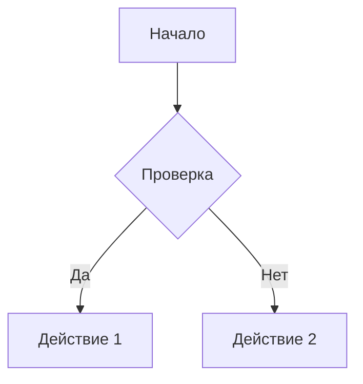

# Markdown Document Converter - Static Web Version

Полностью статическая веб-версия конвертера Markdown, которая работает **исключительно в браузере** без какого-либо бэкенда.

## 🌟 Особенности

- **100% клиентская обработка** - все файлы обрабатываются локально в вашем браузере
- **Полная приватность** - ваши файлы никогда не загружаются на сервер
- **Без установки** - просто откройте в браузере
- **Без регистрации** - бесплатно и анонимно
- **Работает офлайн** - после первой загрузки можно использовать без интернета

## 🚀 Возможности

### Форматы вывода
- **PDF** - с помощью jsPDF и html2canvas
- **DOCX** - с помощью docx.js

### Поддерживаемые элементы Markdown
- Заголовки (H1-H6)
- Параграфы и текст
- Списки (упорядоченные и неупорядоченные)
- Таблицы
- Ссылки
- Изображения (вставленные как Base64)
- Цитаты
- Блоки кода с подсветкой синтаксиса
- Диаграммы Mermaid
- YAML Front Matter для метаданных

### Подсветка синтаксиса
Поддерживается через Highlight.js:
- JavaScript, TypeScript
- Python
- SQL
- JSON, YAML
- HTML, CSS
- Bash/Shell
- И многие другие языки

## 📦 Технологии

### Библиотеки (загружаются из CDN)
- **markdown-it** v13.0.2 - парсинг Markdown
- **Highlight.js** v11.9.0 - подсветка синтаксиса кода
- **jsPDF** v2.5.1 - генерация PDF
- **html2canvas** v1.4.1 - рендеринг HTML в canvas
- **docx.js** v8.5.0 - генерация DOCX файлов
- **file-saver** v2.0.5 - сохранение файлов
- **Mermaid** v10.6.1 - рендеринг диаграмм
- **js-yaml** v4.1.0 - парсинг YAML front matter

## 🌐 Деплой

### Вариант 1: GitHub Pages (Автоматический) ⭐ Рекомендуется

**Автоматический деплой через GitHub Actions:**

1. Форкните или клонируйте репозиторий
2. Перейдите в Settings → Pages
3. В разделе "Build and deployment":
   - Source: выберите **GitHub Actions**
4. Запуште изменения в ветку `main` или `master`
5. GitHub Actions автоматически задеплоит сайт

Ваш сайт будет доступен по адресу: `https://yourusername.github.io/md/`

**Что происходит автоматически:**
- При каждом push в main/master ветку срабатывает workflow
- GitHub Actions собирает и деплоит проект
- Сайт обновляется автоматически в течение 1-2 минут

**Ручной деплой через интерфейс:**

1. Перейдите в Settings → Pages
2. Source: выберите **Deploy from a branch**
3. Branch: `main`, folder: `/ (root)`
4. Сохраните

### Вариант 2: Netlify

1. Зарегистрируйтесь на [Netlify](https://netlify.com)
2. Нажмите "New site from Git"
3. Выберите ваш репозиторий
4. Build settings:
   - Build command: (оставить пустым)
   - Publish directory: `.`
5. Deploy!

### Вариант 3: Vercel

1. Зарегистрируйтесь на [Vercel](https://vercel.com)
2. Import Git Repository
3. Framework Preset: Other
4. Deploy

### Вариант 4: Локальный запуск

Просто откройте `index.html` в браузере:

```bash
# Linux/Mac
open index.html

# или используйте простой HTTP сервер
python -m http.server 8000
# Затем откройте http://localhost:8000

# или с помощью Node.js
npx http-server
```

### Вариант 5: Cloudflare Pages

1. Зарегистрируйтесь на [Cloudflare Pages](https://pages.cloudflare.com)
2. Подключите ваш GitHub репозиторий
3. Build settings:
   - Build command: (оставить пустым)
   - Build output directory: `.`
4. Deploy

## 📁 Структура проекта

```
md/
├── index.html          # Главная страница
├── css/
│   └── style.css       # Стили
├── js/
│   └── app.js          # Логика приложения
├── .github/
│   └── workflows/
│       └── deploy.yml  # GitHub Actions для автодеплоя
├── .gitignore          # Игнорируемые файлы
└── README.md           # Эта документация
```

## 🔧 Использование

### 1. Загрузка файла
- Перетащите `.md`, `.markdown` или `.txt` файл в область загрузки
- Или нажмите "Выберите файл" для выбора из файловой системы
- Максимальный размер: 10MB

### 2. Предпросмотр
После загрузки вы увидите предпросмотр документа с применением всех стилей

### 3. Выбор параметров
- **Формат**: PDF или DOCX
- **Стиль**: Default, Professional, или Minimal

### 4. Скачивание
Нажмите "Скачать документ" - файл сохранится автоматически

## ✨ Примеры Markdown

### YAML Front Matter
```markdown
---
title: "Мой документ"
author: "Иван Иванов"
date: "2024-01-15"
---

# Содержимое документа
```

### Код с подсветкой
````markdown
```python
def hello_world():
    print("Привет, мир!")
```
````

### Таблицы
```markdown
| Название | Описание | Цена |
|----------|----------|------|
| Товар 1  | Описание | 100₽ |
| Товар 2  | Описание | 200₽ |
```

### Mermaid диаграммы
````markdown

````

## 🔒 Безопасность и Приватность

### Полная приватность
- Все обработка происходит локально в вашем браузере
- Файлы НЕ загружаются на какой-либо сервер
- Не используются cookies или аналитика
- Исходный код открыт и доступен для проверки

### Как это работает?
1. Вы выбираете файл
2. JavaScript читает файл локально (File API)
3. markdown-it парсит Markdown в HTML
4. jsPDF/docx.js генерирует документ
5. FileSaver.js сохраняет файл на ваш компьютер

**Ни один байт вашего документа не покидает ваш компьютер!**

## ⚠️ Ограничения

По сравнению с серверной версией (Python):

| Функция | Статическая | Серверная |
|---------|-------------|-----------|
| Приватность | ✅ 100% | ⚠️ Зависит от хостинга |
| Установка | ✅ Не требуется | ❌ Требуется Python |
| Размер файла | ⚠️ До 10MB | ✅ До 100MB+ |
| Качество PDF | ⚠️ Хорошее | ✅ Отличное |
| DOCX форматирование | ⚠️ Базовое | ✅ Полное |
| GraphViz диаграммы | ❌ Не поддерживается | ✅ Поддерживается |
| Mermaid диаграммы | ✅ Поддерживается | ✅ Поддерживается |
| ASCII-арт | ⚠️ Как текст | ✅ Оптимизация/изображение |
| Скорость | ✅ Мгновенно | ✅ Быстро |
| Офлайн работа | ✅ После кэширования | ❌ Нет |

## 🎨 Кастомизация

### Изменение стилей
Отредактируйте `css/style.css`:

```css
/* Изменить цвет темы */
:root {
    --primary-color: #3498db; /* Ваш цвет */
}
```

### Добавление языков подсветки
В `index.html` добавьте после Highlight.js:

```html
<script src="https://cdn.jsdelivr.net/npm/highlight.js@11.9.0/languages/rust.min.js"></script>
```

### Изменение темы подсветки
Замените ссылку на CSS Highlight.js:

```html
<!-- Вместо github-dark используйте: monokai, atom-one-dark, и т.д. -->
<link rel="stylesheet" href="https://cdn.jsdelivr.net/npm/highlight.js@11.9.0/styles/monokai.min.css">
```

## 🐛 Troubleshooting

### PDF получается слишком длинным
**Причина**: html2canvas рендерит весь контент как одно изображение

**Решение**: Используйте серверную версию для больших документов

### DOCX теряет форматирование
**Причина**: docx.js поддерживает базовое форматирование

**Решение**: Используйте серверную версию для сложных документов

### Mermaid диаграммы не отображаются
**Причина**: Ошибка в синтаксисе диаграммы

**Решение**: Проверьте синтаксис на [Mermaid Live Editor](https://mermaid.live)

### Большие файлы зависают
**Причина**: Браузерные ограничения на обработку

**Решение**: Разбейте документ на части или используйте серверную версию

## 🔄 Обновления

Все библиотеки загружаются из CDN с указанием версий. Для обновления:

1. Откройте `index.html`
2. Найдите строку с библиотекой
3. Измените номер версии на актуальную
4. Проверьте совместимость

## 📄 Лицензия

MIT License

## 🤝 Вклад

Приветствуются pull requests и issues!

## 🔗 Ссылки

- [Основной репозиторий](https://github.com/Sign25/md)
- [Демо](https://yourusername.github.io/md/) - замените на ваш URL
- [GitHub Actions Workflow](.github/workflows/deploy.yml)

## 💡 Альтернативы

Если вам нужна более мощная обработка:
- Используйте [Pandoc](https://pandoc.org) для максимальной гибкости и поддержки множества форматов
- Используйте [Marked](https://marked.js.org/) для других JavaScript-решений
- Рассмотрите серверные решения на Python/Node.js для больших файлов

## 📞 Поддержка

Для вопросов и предложений создавайте issue в репозитории.

---

**Версия**: 2.0.0 (Static)
**Последнее обновление**: 2024
